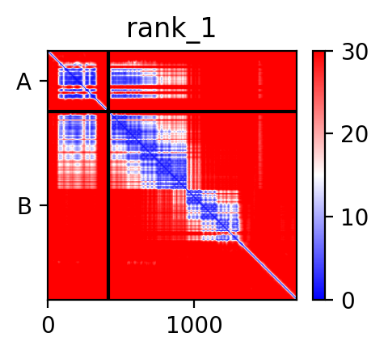
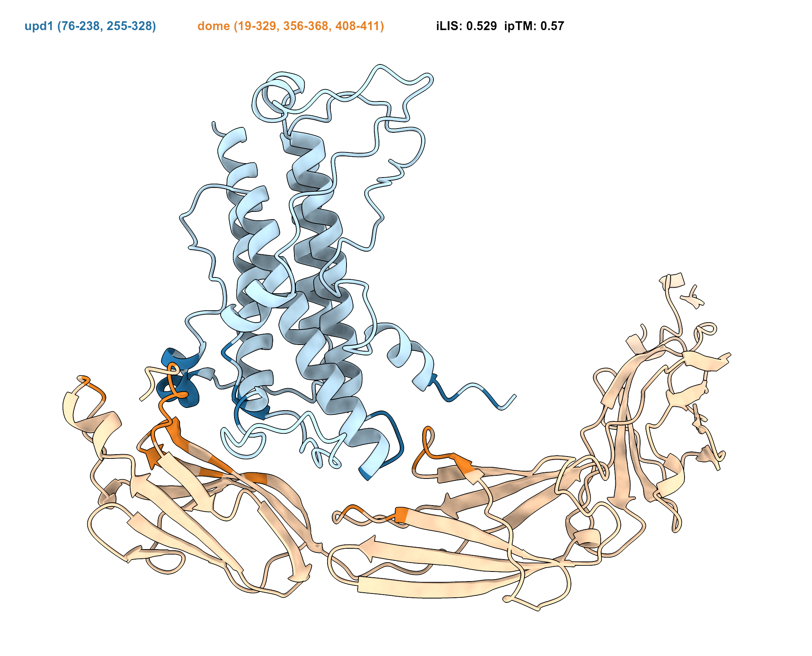

# LIVIA — **L**ocal **I**nteraction **VI**sualization and **A**nalysis

Browser-based tools for analyzing protein-protein interactions from structure predictions. All analysis runs locally in your browser — no data leaves your device and no installation is needed.

**Web:** https://flyark.github.io/LIVIA/ &nbsp;·&nbsp; **Preprint:** [Kim & Perrimon 2026, *bioRxiv*](https://doi.org/10.64898/2026.05.01.721633)

## Example

**[upd1–dome](https://www.flyrnai.org/tools/fly_predictome/web/famdb_details/upd1/dome/SET_69/)** (*Drosophila* JAK-STAT pathway, orthologous to human IL-6/gp130) — ChimeraX visualization generated by LIVIA script (iLIS: 0.529, ipTM: 0.57)

<p>


</p>

*Left: PAE map (A: upd1, B: dome) showing confident interaction region (blue). Right: ChimeraX structure with LIR (light) and cLIR (dark) coloring.*

## Features

- **Drag & drop** — upload prediction files directly into your browser (.zip, .gz, .xz, .cif, .pdb, .json, .npz, .npy)
- **Auto-detection** — automatically identifies the prediction platform from filenames
- **Interaction residue detection** — LIR (PAE ≤ 12Å) and cLIR (PAE ≤ 12Å & Cβ ≤ 8Å)
- **Confidence scoring** — iLIS, iLIA, iLISA, ipSAE, ipTM per chain pair
- **Interactive visualizations** — PAE/LIS/cLIS heatmaps, sequence viewer, linear contact map, chord diagram
- **3D structure viewer** — Mol* viewer with LIR/cLIR coloring
- **ChimeraX and PyMOL scripts** — color presets (gradient, solid, high contrast, pLDDT, bychain)
- **TED domain annotations** — domain boundaries from [AlphaFold DB](https://alphafold.ebi.ac.uk) displayed alongside detected regions
- **CSV download** — full metrics with LIR/cLIR residue indices, LIpLDDT/cLIpLDDT per chain
- **Interactome clustering (cLIP)** — cluster a bait's partners by shared contact residues; per-partner interface maps, searchable sequence viewer, and AlphaFold DB structure resolution
- **Network building (PPI Network)** — Leiden communities from `lis.py` output, computed in-browser (Pyodide + python-igraph)
- **Collaborator workbooks** — cLIP and PPI Network also read `.xlsx` (e.g. Total Predictions / Positive PPI sheets), not just CSV/ZIP

## Pages

| Page | Description |
|------|-------------|
| **[Prediction Analysis](https://flyark.github.io/LIVIA/universal.html)** | Upload and analyze multi-platform predictions |
| **[FlyPredictome](https://flyark.github.io/LIVIA/flypredictome.html)** | *Drosophila* PPI analysis from [FlyPredictome](https://www.flyrnai.org/tools/fly_predictome) |
| **[Ortholog Interactome](https://flyark.github.io/LIVIA/ortholog_predictome.html)** | Non-fly predictions from [FlyPredictome](https://www.flyrnai.org/tools/fly_predictome) ortholog search |
| **[AFDB Dimer](https://flyark.github.io/LIVIA/dimer.html)** | Dimer analysis from [AlphaFold DB](https://alphafold.ebi.ac.uk) |
| **[Monomer Subdomain](https://flyark.github.io/LIVIA/monomer.html)** | Intramolecular domain interaction analysis from [AlphaFold DB](https://alphafold.ebi.ac.uk) |
| **[cLIP](https://flyark.github.io/LIVIA/clip.html)** | Cluster a protein's interactome by shared contact residues (cLIR) from `lis.py` output |
| **[PPI Network](https://flyark.github.io/LIVIA/network.html)** | Build an interaction network with Leiden communities, computed in-browser (Pyodide + python-igraph) |
| **[Tutorials](https://flyark.github.io/LIVIA/tutorials.html)** | Step-by-step visual walkthroughs with auto-advancing screenshots |
| **[About](https://flyark.github.io/LIVIA/about.html)** | Metric definitions, color schemes, and references |

## Supported Platforms

Prediction Analysis auto-detects the platform from uploaded files:

**AlphaFold3** · **AlphaFold2** · **ColabFold** · **Boltz-1/2** · **Chai-1** · **OpenFold3** · **Protenix-v2** · **ESMFold2**

## Key Metrics

- **iLIS** — `sqrt(LIS × cLIS)` — integrated Local Interaction Score ([Kim et al. 2026](https://doi.org/10.64898/2026.04.14.718529))
- **LIS** — average confidence of residue pairs with PAE ≤ 12Å ([Kim et al. 2024](https://doi.org/10.1101/2024.02.19.580970))
- **cLIS** — contact-filtered LIS (PAE ≤ 12Å & Cβ ≤ 8Å)
- **iLIA** — `sqrt(LIA × cLIA)` — integrated interaction area
- **iLISA** — `iLIS × iLIA`
- **ipSAE** — interaction prediction Score from Aligned Errors ([Dunbrack, 2025](https://doi.org/10.1101/2025.02.10.637595))
- **actifpTM** — actual interface pTM ([Varga et al., 2025](https://doi.org/10.1093/bioinformatics/btaf107))
- **LIR / cLIR** — Local Interaction Residues / contact-filtered LIR
- **LIpLDDT / cLIpLDDT** — average pLDDT of LIR / cLIR residues per chain

## Batch Analysis: `lis.py` + `lis_to_cxc.py`

For large-scale batch analysis without a browser, use the command-line tools from [AFM-LIS](https://github.com/flyark/AFM-LIS). They support all the same platforms, auto-detect the prediction format, and output CSV / ChimeraX scripts.

**Score predictions with `lis.py`** (writes CSV):

```bash
python lis.py /path/to/predictions/          # auto-detect, process all models
python lis.py /path/to/predictions/ -w 4     # parallel with 4 CPUs
python lis.py alphafold3_output.zip           # zip input
python lis.py /path/to/predictions/ -v        # verbose error details
```

Features: `.gz`/`.xz` decompression, incremental CSV output (safe to interrupt and resume), progress bar with ETA, sorted output by name and rank.

**Generate batch ChimeraX visualizations with `lis_to_cxc.py`** (reads the lis.py CSV, writes one `.cxc` per fold × rank):

```bash
python lis_to_cxc.py \
    --csv results_lis_analysis.csv \
    --pdb-root . \
    --out cxc/
```

Double-click any `.cxc` to open in ChimeraX with LIR (light shade) / cLIR (full shade) coloring and an iLIS/cLIS label panel.

See [AFM-LIS](https://github.com/flyark/AFM-LIS) for full documentation and output CSV column reference.

## Note

- Tested on Chrome and Safari (macOS/iOS).
- Each prediction platform may produce different confidence calibrations. The iLIS ≥ 0.223 threshold was established using ColabFold/AlphaFold-Multimer predictions. Other platforms may require adjusted thresholds.

## Related Resources

- **[AFM-LIS](https://github.com/flyark/AFM-LIS)** — Python framework and CLI for iLIS/LIS calculation
- **[FlyPredictome](https://www.flyrnai.org/tools/fly_predictome)** — Large-scale *Drosophila* PPI predictions (>1.5 million)
- **[AlphaFold Protein Structure Database](https://alphafold.ebi.ac.uk)** — Predicted protein structures

## References

- Kim, A.-R. & Perrimon, N. (2026). LIVIA: a browser-based tool for assessing and visualizing predicted protein interactions. *bioRxiv*. https://doi.org/10.64898/2026.05.01.721633
- Kim, A.-R. et al. (2026). FlyPredictome: a structural atlas of predicted protein-protein interactions in *Drosophila*. *bioRxiv*. https://doi.org/10.64898/2026.04.14.718529
- Kim, A.-R. et al. (2024). Enhanced Protein-Protein Interaction Discovery via AlphaFold-Multimer. *bioRxiv*. https://doi.org/10.1101/2024.02.19.580970

## Citation

If you use LIVIA in your research, please cite:

```bibtex
@article{livia2026,
  author  = {Kim, Ah-Ram and Perrimon, Norbert},
  title   = {LIVIA: a browser-based tool for assessing and visualizing predicted protein interactions},
  year    = {2026},
  journal = {bioRxiv},
  doi     = {10.64898/2026.05.01.721633},
  url     = {https://doi.org/10.64898/2026.05.01.721633}
}
```

## License

MIT
